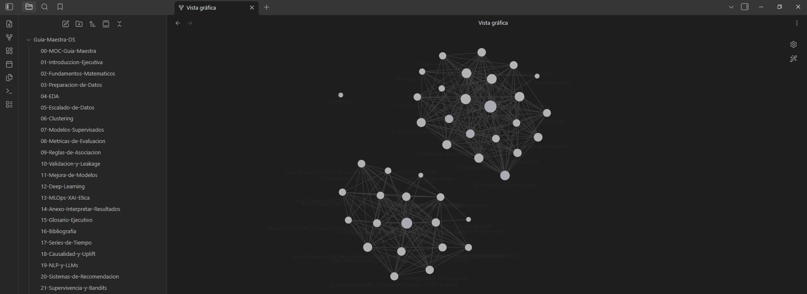

# 📚 Guías Maestras — Data Science & RAG

> Dos manuales de referencia multi-tomo —**Data Science / Machine Learning** y **Retrieval-Augmented Generation**— escritos para leerse en tres capas: técnica, puente y ejecutiva. Cada afirmación, verificada contra su fuente.

---

## 🎯 Objetivo

Este repositorio alberga **dos bases de conocimiento estructuradas, vivas y autocontenidas**:

- La **Guía Maestra de Data Science** recorre el ciclo de vida completo de un proyecto de datos —de la pregunta de negocio al monitoreo en producción—.
- La **Guía Maestra de RAG** recorre el pipeline completo de Retrieval-Augmented Generation —del keyword search a la puesta en producción, la evaluación y los frameworks de orquestación—.

El propósito de ambas es el mismo, y es doble:

- **Ser un manual de referencia** riguroso y a la vez accesible: que un mismo concepto pueda consultarlo un ingeniero, un Product Owner y un gerente, cada uno en su nivel de profundidad.
- **Servir como fuente de verdad para las decisiones**: qué técnica corresponde a cada problema, qué supuestos tiene y cuándo se rompen, cómo interpretar el resultado y cómo explicárselo al negocio.

## 📖 Las dos guías, y por qué son distintas

Son proyectos hermanos, pero **no se escriben igual** — y la diferencia es deliberada:

| | 📊 **Data Science** | 🔎 **RAG** |
|---|---|---|
| **Tomos** | 22 | 15 (+ índice maestro) |
| **Fuente primaria** | Ninguna — se apoya solo en su bibliografía | Un curso completo de DeepLearning.AI: transcripciones, notebooks y láminas |
| **¿Lleva código?** | **No, por diseño.** Vive en el plano conceptual y de decisión | **Sí.** Código funcional, ejecutado y verificado |
| **Cómo se verifica** | Cada afirmación se ancla a una referencia comprobable | Se contrasta contra el material del curso *y* se ejecuta el código |
| **Qué la hace fiable** | 121 fuentes verificadas una por una | 52 obras verificadas + código que se corrió de verdad |

> 💡 **Por qué la de DS no lleva código:** sin fuente primaria externa, la bibliografía es el **único** mecanismo de verificación de la guía. Por eso el esfuerzo se puso ahí y no en la sintaxis de cada librería, que envejece y que la documentación oficial ya cubre mejor.

## 👥 Tres audiencias, un solo documento

El lector decide qué leer. Cada bloque está etiquetado visualmente para que sepas de inmediato qué te corresponde:

| Etiqueta | Perfil | Qué encuentra |
|---|---|---|
| 🔧 **Técnico** | Data Scientist · Data / ML / AI Engineer | Definiciones formales, fórmulas, parámetros, supuestos, limitaciones |
| 🧭 **Puente** | Product Owner · Líder técnico · Analista | Cuándo usar qué, trade-offs de decisión, traducción negocio↔técnica |
| 👔 **Ejecutivo** | Gerente · C-level · Stakeholder | Impacto en el negocio, riesgos, costo de hacerlo mal |
| 💡 **Analogía** | Todos | La intuición, con una analogía cotidiana. Sin prerrequisitos |

## 🗂️ Guía Maestra de Data Science — 22 tomos

En [`Guia-Maestra-DS/`](Guia-Maestra-DS/), ordenados según el ciclo de vida de un proyecto de datos.

**Núcleo (00–16) — el recorrido principal:**

- **Fundamentos** — `01` Introducción Ejecutiva · `02` Fundamentos Matemáticos
- **Datos** — `03` Preparación de Datos · `04` EDA · `05` Escalado de Datos
- **Modelado** — `06` Clustering · `07` Modelos Supervisados · `08` Métricas de Evaluación · `09` Reglas de Asociación
- **Rigor y producción** — `10` Validación y Leakage · `11` Mejora de Modelos · `12` Deep Learning · `13` MLOps, XAI y Ética
- **Para el negocio** — `14` Interpretar Resultados (sin programar) · `15` Glosario Ejecutivo · `16` Bibliografía

**Extensión aplicada (17–21) — dominios especializados:**

`17` Series de Tiempo · `18` Causalidad y Uplift · `19` NLP y LLMs · `20` Sistemas de Recomendación · `21` Supervivencia y Bandits

> 🗺️ **Punto de entrada:** [`00-MOC-Guia-Maestra.md`](Guia-Maestra-DS/00-MOC-Guia-Maestra.md) — índice maestro con el mapa de contenido, las rutas de lectura por perfil y el estado de cada tomo.

## 🗂️ Guía Maestra de RAG — 15 tomos

En [`Retrieval Augment Generation - RAG/Guía Maestra/`](Retrieval%20Augment%20Generation%20-%20RAG/Gu%C3%ADa%20Maestra/), siguiendo el pipeline de RAG de principio a fin.

**Sobre el curso (01–11) — el recorrido principal:**

- **Fundamentos** — `01` Introducción a RAG · `02` LLMs y el pipeline RAG
- **Retrieval** — `03` Keyword search (TF-IDF, BM25) · `04` Semantic search, embeddings y hybrid search · `05` Vector databases y ANN (HNSW) · `06` Chunking · `07` Query parsing, scoring y re-ranking
- **Generación y evaluación** — `08` Transformers, sampling y prompt engineering · `09` Hallucinations, evaluación y agentic RAG
- **Producción** — `10` Observability, evaluación y security · `11` Quantization, trade-offs de cost/latency y multimodal RAG

**Complementos de vanguardia (12–13)** — lo que el curso no cubre, con bibliografía externa verificada **antes** de escribir:

`12` ⭐ Query decomposition, multi-query y GraphRAG · `13` ⭐ Frameworks de orquestación: LangChain, LlamaIndex, DSPy — y la opción de no usar ninguno

**Transversales:** `15` Glosario Ejecutivo · `16` Bibliografía

> 🗺️ **Punto de entrada:** [`Guia-Maestra-RAG_00-MOC-Guia-Maestra-RAG.md`](Retrieval%20Augment%20Generation%20-%20RAG/Gu%C3%ADa%20Maestra/Guia-Maestra-RAG_00-MOC-Guia-Maestra-RAG.md)

## 🧭 Cómo usarlas

- **En Obsidian (recomendado):** abre la carpeta raíz como *vault*. Ambas guías comparten espacio de nombres, así que los wikilinks cruzan de una a otra: el tomo de NLP y LLMs de DS enlaza con los de RAG, y viceversa.
- **En cualquier lector Markdown / GitHub:** cada tomo es un `.md` autocontenido y legible por sí solo; los diagramas son ASCII y las fórmulas, notación inline —sin dependencias externas—.
- **Por perfil:** cada índice maestro propone rutas de lectura para ejecutivos, perfiles puente y técnicos.

## 🤖 Doble función: manual humano + base de conocimiento para IA

Además de manuales de lectura, ambas guías están pensadas para actuar como **fuente de conocimiento primaria de asistentes de IA**. La división de trabajo es explícita: la guía de **DS** es base de verdad para las **decisiones** (qué hacer y por qué), no para la implementación; la de **RAG** sí incluye código funcional y decisiones de arquitectura justificadas, porque su material de origen permite verificarlo.

## 🌱 Documentos vivos

Ambas guías se mantienen y evolucionan: cada tomo lleva versión y fecha de última revisión en su *frontmatter*, y cada índice maestro conserva su tracker de estado y su bitácora de correcciones. Son proyectos en mejora continua, no ediciones cerradas.

## 📄 Licencia

El contenido propio de estas guías se distribuye bajo licencia **MIT** — consulta [`LICENSE`](LICENSE) para los términos completos. El material de curso incluido como referencia de trabajo pertenece a sus respectivos autores y no está cubierto por esta licencia.

## ✍️ Autor

**Diego Evans Pérez Paz** — © 2026
